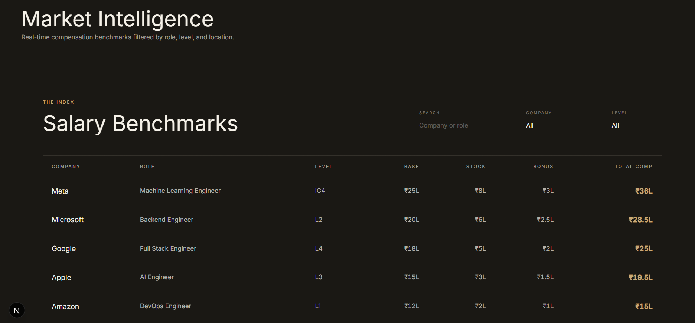
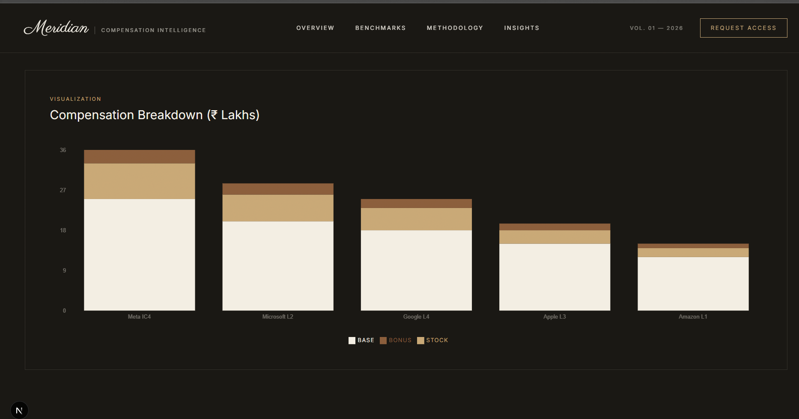
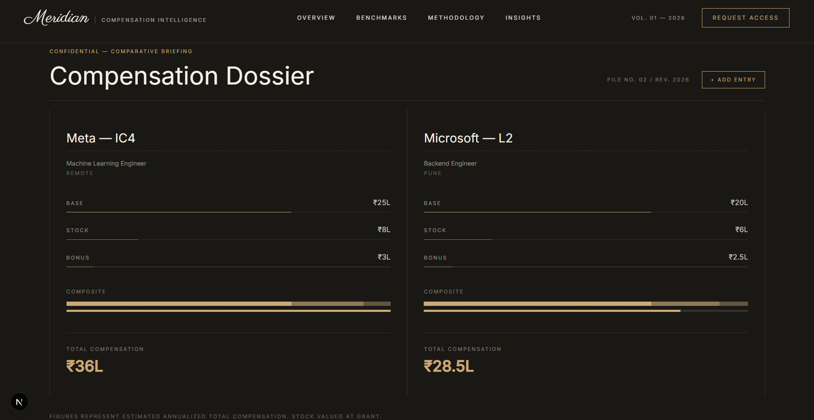
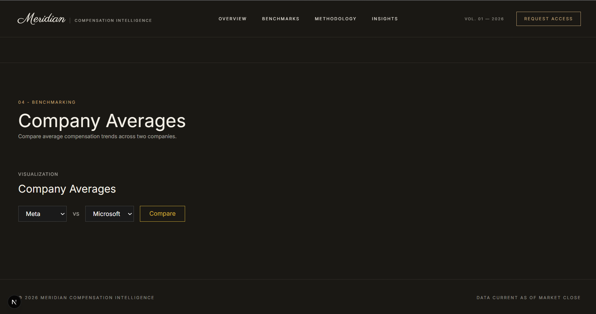

# Meridian - Compensation Intelligence Platform

A full-stack compensation benchmarking platform built to explore real-world salary data across companies, roles, and levels - with support for multi-currency formatting, side-by-side comparisons, and company-level aggregate analysis.

Built as a personal learning project to go deep on full-stack architecture: JWT auth, relational schema design with Prisma, and a data-dense but editorial-feeling frontend.

---

## Features

- **Authentication** - JWT-based register/login flow with protected routes
- **Search & Filter** - Query compensation records by company, role, level, location, and experience range
- **Salary Benchmarks Table** - Sortable, real-time filtered view of all records
- **Compensation Breakdown Chart** - Stacked bar visualization (Base / Bonus / Stock) per record
- **Comparison Dossier** - Add/remove up to 3 individual compensation profiles for side-by-side comparison
- **Company Averages** - Aggregate comparison of average pay between any two companies
- **Currency-aware formatting** - INR shown in Lakh/Crore (Rs 36L, Rs 2.5Cr), other currencies (USD/EUR/GBP) in compact notation

---

## Tech Stack

**Frontend**
- Next.js (App Router) + TypeScript
- TailwindCSS v4
- Framer Motion (animations)
- Recharts (data visualization)

**Backend**
- Express + TypeScript
- Prisma ORM
- PostgreSQL (hosted on Neon)
- JWT authentication

---

## Screenshots

### Landing Page


### Salary Benchmarks Table


### Compensation Breakdown Chart


### Comparison Dossier


### Company Averages


---

## Architecture
compensation-intelligence-system/
├── frontend/          Next.js + TypeScript + TailwindCSS
│   └── src/
│       ├── app/           Pages (home, auth)
│       ├── components/    DataTable, CompensationChart, ComparisonView, CompanyCompare
│       ├── context/       AuthContext (JWT + localStorage)
│       └── lib/           api.ts - typed fetch wrappers
│
└── backend/           Express + TypeScript + Prisma
└── src/
├── routes/        auth, search, compare, companies, roles, levels, compensations
├── controllers/   Request handling
├── services/       Business logic
├── repositories/   Prisma queries
└── middleware/     JWT authentication


## API Routes

| Method | Route                    | Description                                  | Auth |
|--------|---------------------------|-----------------------------------------------|------|
| POST   | `/api/v1/auth/register`   | Create new user                                | No   |
| POST   | `/api/v1/auth/login`      | Login, returns JWT                             | No   |
| GET    | `/api/v1/auth/me`         | Get current user                               | Yes  |
| GET    | `/api/v1/search`          | Search records (company/role/level/location/exp/sort/page) | Yes |
| GET    | `/api/v1/compare`         | Compare average pay between two companies      | Yes  |
| GET    | `/api/v1/companies`       | List all companies                             | Yes  |
| GET    | `/api/v1/roles`           | List all roles                                 | Yes  |
| GET    | `/api/v1/levels`          | List all levels                                | Yes  |
| GET    | `/api/v1/compensations`   | Raw compensation records                       | Yes  |
| GET    | `/api/v1/analytics`       | Aggregate analytics                            | Yes  |

---

## Getting Started

### Prerequisites
- Node.js
- A PostgreSQL database (e.g. Neon - https://neon.tech)

### Backend Setup
```bash
cd backend
npm install
```

Create a `.env` file in `backend/`:DATABASE_URL=your_postgres_connection_string
JWT_SECRET=your_secret_key
JWT_EXPIRES_IN=7d
PORT=5000

```bash
npx prisma migrate dev
npx prisma db seed
npm run build
node dist/src/server.js
```

### Frontend Setup
```bash
cd frontend
npm install
```

Create a `.env.local` file in `frontend/`: NEXT_PUBLIC_API_URL=http://localhost:5000

```bash
npm run dev
```

Visit `http://localhost:3000`.

---

## What I Learned

- Designing a relational schema with normalized foreign keys (company/role/level as separate tables) instead of storing strings directly on the compensation record
- Handling currency formatting correctly for a primarily INR audience - realized late that generic Intl.NumberFormat compact notation produces US-style output ("$3.6M") that doesn't match how Indian salaries are actually discussed (Lakh/Crore), and built a custom formatter instead
- Building comparison UIs that stay in sync with a single source of truth (the same formatting helper is shared across the table, chart, and both comparison views)
- Git hygiene on a real project - keeping `.env` and stray compiled build artifacts out of version control, and recovering from a missing `.gitignore` in one folder

---

## Roadmap

- [ ] Wire `/api/v1/analytics` to a dedicated analytics dashboard
- [ ] Add pagination controls to the Salary Benchmarks table
- [ ] Support editing/adding compensation records from the UI
- [ ] Deploy frontend (Vercel) and backend (Render/Railway)

---

